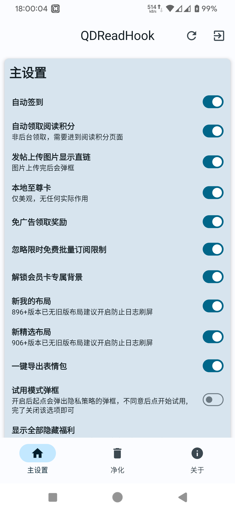
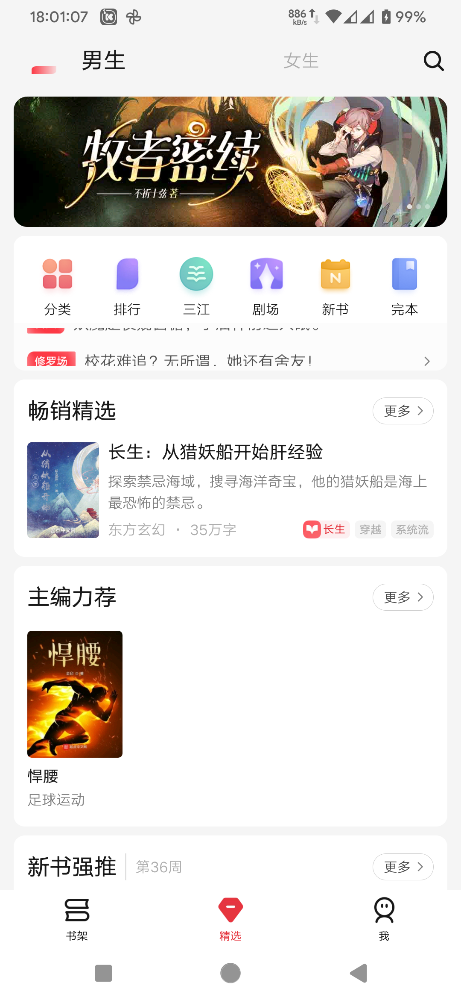

## QDReadHook 起点阅读 Xposed 模块

用于起点读书的自定义增强模块，包含自定义增强、广告相关、闪屏页相关、隐藏控件、替换净化等功能。

> 本模块仅供学习交流。使用前请阅读 [起点读书用户服务协议](https://acts.qidian.com/pact/user_pact.html) 和本文末尾的免责声明。

## 下载

- [LSPosed Repo / GitHub Releases](https://github.com/Xposed-Modules-Repo/cn.xihan.qdds/releases)
- [蓝奏云](https://xihan.lanzouj.com/b042w7oqb)，密码：`9ikq`
- 起点读书：[酷安](https://www.coolapk.com/apk/5066/) / [官方网站](https://www.yuewen.com/app.html#appqd)

不再提供内置版。如需内置版，请自行制作。

## 兼容说明

- 目前公开版最后一个明确支持内置起点版本：`7.9.428`，后续因为起点有数字加固无法内置，望周知
- 设置入口：起点读书 -> 我的 -> 左上角设置 -> QD 模块设置
- 配置保存位置：`3.2.7+` 起点私有目录 `shared_prefs`
- 共存包名：需要在原始包名后面增改，直接使用共存内置版即可
- 旧 [极狐 GitLab 仓库](https://jihulab.com/xihan123/QDReadHook) 已过时，请以本仓库说明为准

## 使用方式

1. 安装模块。
2. 在 LSPosed / Xposed 中启用模块，并勾选起点读书或对应共存包。
3. 强行停止起点读书后重新打开。
4. 进入 `QD 模块设置` 调整功能。

修改配置后如果功能未立即生效，优先强行停止起点读书并重新打开；仍无效再清除起点缓存或更新到最新版模块。

## 常见问题

- 提示 `Manifest文件中Activity/Service/Permission的声明有问题或者Permission权限未授予`、`初始化错误`、`初始化失败`：在 `广告配置` 中取消勾选 `GDT(TX)广告`。
- 提示 `激励广告拉取失败, 详细错误码:50000`：检查网络、DNS 或 Hosts 是否拦截 `e.qq.com`、`gdt.qq.com`、`gtimg.cn`、`gdtimg.com`。
- 开关功能不生效：确认起点版本在支持范围内，修改配置后强行停止起点；仍无效可清除起点数据、重启设备或更新模块。
- 闪屏页、自定义启动图、去广告异常：多数是本地缓存导致，可在关于页面清除起点缓存，或清除起点数据后重试。
- 激活模块或 LSPatch 版起点闪退：关闭免广告领取奖励、快速屏蔽弹框；确认没有同时启用模块和 LSPatch 版；仍闪退可删除配置文件并重启起点。注意`7.9.428`之后的版本已有数字加固，自行解决相关问题
- 提示设备环境异常、账号异常：起点加强了风控。设备问题请自行隐藏 Root 环境；账号问题需自行确认风险状态。
- 试用模式、正文章节异常、红包广场无限加载：试用模式需要开启自定义 QIMEI 且不能为空；也可能是账号或设备风控。
- Android 9 从起点内进入设置白屏：可额外安装模块本体来管理配置。

## 收集服务声明

- 收集服务需要用户自愿开启。
- 会收集书籍信息、阅读时长、书架书 ID，用于开发统计和推荐模型。
- 数据仅供统计和训练模型使用，不提供其他服务，不参与商业行为。
- [阅读时长排行榜](https://rank.xihan.website/) 只基于模块收集服务数据，不代表起点官方数据，仅供参考。

## 交流与提醒

- [TG 防失联交流群](https://t.me/+h72AhSQtsSdlYmU1)
- QD 模块交流群：[963079548](https://qm.qq.com/cgi-bin/qm/qr?k=wlD8adp7c17yXvnrJWrq_bNkjSpos6ot&jump_from=webapi&authKey=vkNN3oR/ZwsHJjzLRakReCG5Yf4wv6Kcyn3K/MydwaX8kMoqBj6Qen3DfZJCfxB8)

请不要在公共平台大范围宣传本项目，也不要在非 QD 模块群组内讨论相关内容。模块永久免费，请警惕倒卖、冒充作者、二次打包等行为。

## 免责声明

- 本模块基于 Xposed 框架开发，会修改系统或应用行为，可能导致应用异常、设备不稳定、无法开机或数据损失。
- 使用本模块可能违反起点读书用户服务协议。请自行确认使用场景是否合法合规，并自行承担账号、设备和数据风险。
- 请确认下载渠道可信，不要使用来路不明的改包或二次分发包。
- 本模块不保证功能效果，不对任何直接或间接损失负责。
- 本模块仅供学习交流，请在下载 24 小时内删除；如不同意本文说明，请不要下载或使用。

## 截图

<table>
<tr>
<td></td>
<td></td>
</tr>
</table>

## 打赏

入驻了 [爱发电](https://afdian.net/a/xihan123)。如果这个模块对你有用，可以随意打赏，支持后续更新。

<table>
<tr>
<td align="center">支付宝</td>
<td align="center">微信</td>
</tr>
<tr>
<td></td>
<td></td>
</tr>
</table>
